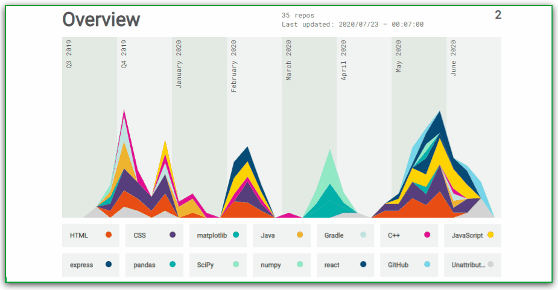

# Hello, geeks! 👋

I am _Rohit Nagar_. Final-Year undergraduate at IIT Jodhpur. I am experienced developer skilled in  C, C++, Python3, JavaScript, Solidity with proficiency in C++, Python, and JavaScript. I have experience working with ReactJs, ExpressJs, Django, Truffle , Ganache and MongoDB for building applications. For machine learning and deep learning models, I use Python, along with libraries/frameworks such as TensorFlow, Numpy, and NLP. Additionally, I use C/C++ for competitive programming  on platforms like codeforces, CodeChef, and leetcode. I am constantly exploring new technologies and was particularly intrigued by blockchain and Web3 after my summer internship at **Accenture**.

### ⚡ One line that describes me best? 
An ambitious guy who loves to write code, play cricket, day dream at nights and sometime codes too.😉😉

### 📫 How to reach me?
- [Twitter](https://twitter.com/0xRohit_) 
- [LinkedIn](https://www.linkedin.com/in/rohit-nagar-8649aa1a2/) 
- [My personal portfolio](https://rohitportfolio.gatsbyjs.io/) 

You can ask me anything (within reason). I am looking forward to absorb knowledge🧠,gain experience 🏭, collaborate🤝 and build amazing products 🏭for the world🌍!

 
  Visitors count 
  

  

***

<!--
**garimasingh128/garimasingh128** is a ✨ _special_ ✨ repository because its `README.md` (this file) appears on your GitHub profile.

Here are some ideas to get you started:

- 🔭 I’m currently working on ...
- 🌱 I’m currently learning ...
- 👯 I’m looking to collaborate on ...
- 🤔 I’m looking for help with ...
- 💬 Ask me about ...
- 📫 How to reach me: ...
- 😄 Pronouns: ...
- ⚡ Fun fact: ...
-->

